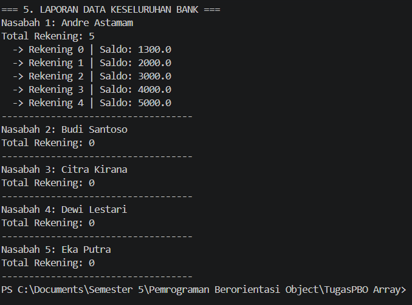

Tugas Array - Sistem Bank

Nama: Andre Astamam
NIM: F1D02410103

1. Deklarasi dan Inisialisasi Array
Letak pada Kode:
Array digunakan di dua tempat. Pada kelas Bank ada private Customer[] customers = new Customer[5]; untuk menyimpan objek nasabah. Pada kelas Customer ada private Account[] accounts = new Account[5]; untuk menyimpan objek rekening. Kedua array ini berisi objek (bukan tipe primitif), dan ukurannya tetap yaitu 5. Artinya, satu bank hanya bisa menampung maksimal 5 nasabah, dan satu nasabah hanya bisa punya maksimal 5 rekening.
2. Penghitung Elemen (Counter)
Letak pada Kode:
Karena ukuran array bersifat tetap, saya memakai variabel numberOfCustomers di kelas Bank dan numberOfAccounts di kelas Customer untuk mencatat berapa slot yang sudah terisi. Variabel ini sekaligus menjadi indeks slot kosong berikutnya. Contohnya pada baris customers[numberOfCustomers++] = new Customer(firstName, lastName);, objek baru disimpan di indeks saat ini, lalu counter bertambah 1. Nilai counter dibaca lewat getNumberOfCustomers() dan getNumberOfAccounts().
3. Pembatasan Kapasitas Array
Letak pada Kode:
Sebelum menambah data, kode mengecek kondisi if (numberOfCustomers < customers.length) pada addCustomer() dan if (numberOfAccounts < accounts.length) pada setAccount(). Jika array sudah penuh, program mencetak pesan "Cannot add more customers. Maximum limit reached." atau "Cannot add more accounts. Maximum limit reached." dan tidak menambahkan data, sehingga tidak terjadi ArrayIndexOutOfBoundsException. Pada kelas Main, hal ini diuji dengan mendaftarkan nasabah ke-6 (Fajar) dan membuka rekening ke-6 untuk Andre, dan keduanya ditolak.
4. Mengakses Elemen Array Berdasarkan Indeks
Letak pada Kode:
Ini terlihat pada metode getCustomer(int customerIndex) di Bank dan getAccount(int accountIndex) di Customer. Keduanya memvalidasi indeks dengan >= 0 dan < jumlah elemen terisi (bukan < length), lalu mengembalikan customers[customerIndex] atau accounts[accountIndex]. Jika indeks tidak valid, metode mencetak "Invalid ... index." dan mengembalikan null. Pada Main, contohnya bankMandiri.getCustomer(0) untuk mengambil Andre dan andre.getAccount(0) untuk mengambil rekening utamanya.
5. Iterasi Array dengan Perulangan (Nested Loop)
Letak pada Kode:
Pada bagian laporan di Main, saya memakai perulangan for bersarang. Loop luar for (int i = 0; i < bankMandiri.getNumberOfCustomers(); i++) menelusuri semua nasabah, sedangkan loop dalam for (int j = 0; j < nasabah.getNumberOfAccounts(); j++) menelusuri semua rekening milik nasabah tersebut. Batas perulangan memakai jumlah elemen terisi, bukan panjang array, agar slot kosong (null) tidak ikut diakses.
6. Encapsulation pada Array
Letak pada Kode:
Kedua array dideklarasikan private, sehingga kelas Main tidak bisa mengubahnya secara langsung. Akses hanya melalui metode publik seperti addCustomer(), getCustomer(), setAccount(), dan getAccount(), yang sudah berisi validasi.
7. Relasi Antar Objek (Array of Objects)
Letak pada Kode:
Struktur program membentuk hubungan berjenjang: Bank memiliki banyak Customer, dan Customer memiliki banyak Account. Dengan array, satu objek induk dapat menyimpan kumpulan objek anak, sehingga data dapat dikelompokkan dan ditelusuri dengan rapi.
8. Simulasi Transaksi pada Elemen Array
Letak pada Kode:
Objek Account yang diambil dari array bisa langsung dipakai untuk transaksi. Rekening utama Andre (indeks 0) bersaldo awal 1000.0, lalu deposit(500.0) menjadikannya 1500.0, dan withdraw(200.0) menjadikannya 1300.0. Penarikan 10.000 ditolak karena withdraw() mengembalikan false saat saldo tidak cukup. Hasilnya terlihat di laporan akhir: Rekening 0 bersaldo 1300.0, sedangkan rekening lain tidak berubah.
